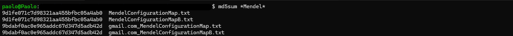

***Personal technical analysis of Android Gmail app***.

# Index

- [dumping](#dumping)
- [app_textures](#app_textures)
- [app_webview](#app_webview)
- [no_backup](#no_backup)
- [shared_prefs](#shared_prefs)
- [lib](#lib)
- [files](#files)
- [databases](#databases)
- [bigTopDataDB-analysis](#bigTopDataDB-analysis)

## dumping

It has been used a rooted Android device. Dumping of Gmail data folder is very easy thanks to ADB.

```shell
paolo@Paolo:~$ adb pull /data/data/com.google.android.gm
```

The `com.google.android.gm` directory is structured as follows.

```shell
paolo@Paolo:$ tree -L 1 com.google.android.gm/
com.google.android.gm/
├── app_textures
├── app_webview
├── databases
├── files
├── lib
├── no_backup
└── shared_prefs

7 directories, 0 files
```

## app_textures

From the analysis, the `app_textures` folder was empty.

```shell
paolo@Paolo:$ tree com.google.android.gm/app_textures/
com.google.android.gm/app_textures/

0 directories, 0 files
```

## app_webview

`app_webview` folder contained the following files and directories.

```shell
paolo@Paolo:$ tree com.google.android.gm/app_webview/
com.google.android.gm/app_webview/
├── Default
│   ├── Local Storage
│   │   └── leveldb
│   │       ├── 000003.log
│   │       ├── CURRENT
│   │       ├── LOCK
│   │       ├── LOG
│   │       └── MANIFEST-000001
│   ├── Web Data
│   ├── Web Data-journal
│   └── blob_storage
│       └── da2ae1fb-a4e1-4849-9f0d-3384bca5729b
├── pref_store
└── webview_data.lock
```

At the first level of the hierarchy, there were two files (`pref_store` and `webview_data.lock`) and one folder (`Default`).

### pref_store and webview_data.lock

`pref_store` file contained two piece of information:
- installation date expressed in Unix epoch time
- a field named `low_entropy_source3`. It was not possible to understand how this field is used

```shell
paolo@Paolo:$ cat com.google.android.gm/app_webview/pref_store
{"uninstall_metrics":{"installation_date2":"1711099425"},"user_experience_metrics":{"low_entropy_source3":1121}}
```

In the specific case, the `installation_date2` field was "1711099425" and it corrisponds to "Friday 22 March 2024 09:23:45 (GMT)", i.e. the date on which the application was installated.

`webview_data.lock` file appeared to contain nothing interesting.

```shell
paolo@Paolo:$ strings webview_data.lock
com.google.android.gm
```

### Default

`Default` contained a number of files, three of them (`000003.log`, `LOCK` and `Web Data-journal`) were empty. 

```shell
paolo@Paolo:$ find ./app_webview/Default/ -type f -exec file {} \;
./app_webview/Default/Local Storage/leveldb/000003.log: empty
./app_webview/Default/Local Storage/leveldb/CURRENT: ASCII text
./app_webview/Default/Local Storage/leveldb/LOCK: empty
./app_webview/Default/Local Storage/leveldb/LOG: ASCII text
./app_webview/Default/Local Storage/leveldb/MANIFEST-000001: PGP Secret Key -
./app_webview/Default/Web Data: SQLite 3.x database, last written using SQLite version 3038005
./app_webview/Default/Web Data-journal: empty
```

`Web Data` is a SQLite database, but, almost all tables were empty. `Web Data` contained a lot of tables, some of which are very interesting.

```shell
sqlite> .open 'Web data'
sqlite> .tables
autofill                      meta
autofill_model_type_state     offer_data
autofill_profile_addresses    offer_eligible_instrument
autofill_profile_birthdates   offer_merchant_domain
autofill_profile_emails       payments_customer_data
autofill_profile_names        payments_upi_vpa
autofill_profile_phones       server_address_metadata
autofill_profiles             server_addresses
autofill_sync_metadata        server_card_cloud_token_data
credit_cards                  server_card_metadata
masked_credit_cards           unmasked_credit_cards
```

To sum up, after some investigation, `Web Data` database and its tables are legitimate. As can be read in [https://security.stackexchange.com/questions/179523/why-does-my-cordova-app-contain-an-sqlite-file-with-credit-card-tables](https://security.stackexchange.com/questions/179523/why-does-my-cordova-app-contain-an-sqlite-file-with-credit-card-tables) and [https://issues.chromium.org/issues/41204739](https://issues.chromium.org/issues/41204739), `Web Data` database is the default database that is created to cache the webview data.

## no_backup

`no_backup` directory contained only four files.

```shell
paolo@Paolo:$ find ./no_backup/ -type f -exec file {} \;
./no_backup/androidx.work.workdb: SQLite 3.x database, user version 21, last written using SQLite version 3022000
./no_backup/androidx.work.workdb-shm: data
./no_backup/androidx.work.workdb-wal: SQLite Write-Ahead Log, version 3007000
./no_backup/com.google.android.gms.appid-no-backup: empty
```

Among these files, the most interesting was `androidx.work.workdb`. It is a SQLite database that stores all jobs of WorkManager. WorkManager is an Android concept used to manage persistent scheduled tasks. More details here: [https://developer.android.com/topic/libraries/architecture/workmanager](https://developer.android.com/topic/libraries/architecture/workmanager). `androidx.work.workdb` database contained several tables.

```shell
sqlite> .open androidx.work.workdb
sqlite> .tables
Dependency         WorkName           WorkTag
Preference         WorkProgress       android_metadata
SystemIdInfo       WorkSpec           room_master_table
```

All jobs are listed in `WorkSpec` table.

```shell
sqlite> select * from workspec;
4c786273-548e-4dd4-93ab-6a40e5ff9437|2|com.google.android.libraries.hub.workmanager.HubListenableWorker|androidx.work.OverwritingInputMerger|??|??|0|0|0|1|0|30000|1711099355677|0|1711099355743|0|0|0|0|9223372036854775807|0|-256|0||0|0|0|0|-1|-1|
6508dc27-0c6e-486c-ab0a-980c3060b3da|2|com.google.android.libraries.hub.workmanager.HubListenableWorker|androidx.work.OverwritingInputMerger|??|??|0|0|0|1|0|30000|1711099355920|0|1711099356100|0|0|0|0|9223372036854775807|0|-256|0||0|0|0|0|-1|-1|
ff329a53-bb87-4f1c-8bf4-67fd96783e68|2|com.google.android.libraries.hub.workmanager.HubListenableWorker|androidx.work.OverwritingInputMerger|??|??|0|0|0|1|0|30000|1711099356639|0|1711099356692|0|0|0|0|9223372036854775807|0|-256|0||0|0|0|0|-1|-1|
176be6bf-c29e-43a1-b243-3de3bdcd0de2|2|com.google.android.libraries.hub.workmanager.HubListenableWorker|androidx.work.OverwritingInputMerger|??|??|0|0|0|1|0|30000|1711099357238|0|1711099357288|0|0|0|0|9223372036854775807|0|-256|0||0|0|0|0|-1|-1|
fba2d0e9-8643-4f78-b10f-0945c7ef9837|0|com.google.apps.tiktok.contrib.work.TikTokListenableWorker|androidx.work.OverwritingInputMerger|??|??|605256547|0|0|0|0|30000|1711099357629|0|1711099357695|0|0|0|0|9223372036854775807|0|-256|0||0|0|0|0|-1|-1|
812a4284-4391-4e1f-8e55-9ea2f6fcdf89|0|com.google.apps.tiktok.contrib.work.TikTokListenableWorker|androidx.work.OverwritingInputMerger|??|??|259656547|0|0|0|0|30000|1711099357708|0|1711099357742|0|0|0|0|9223372036854775807|0|-256|0||1|0|0|0|-1|-1|
```

| `id`                                 | `state` | `worker_class_name`                                              | `input_merger_class_name`            | `input` | `output` | `initial_delay` | `interval_duration` | `flex_duration` | `run_attempt_count` | `backoff_policy` | `backoff_delay_duration` | `last_enqueue_time` | `minimum_retention_duration` | `schedule_requested_at` | `run_in_foreground` | `out_of_quota_policy` | `period_count` | `generation` | `next_schedule_time_override` | `next_schedule_time_override_generation` | `stop_reason` | `required_network_type` | `required_network_request` | `requires_charging` | `requires_device_idle` | `requires_battery_not_low` | `requires_storage_not_low` | `trigger_content_update_delay` | `trigger_max_content_delay` | `content_uri_triggers` |
| ------------------------------------ | ------- | ---------------------------------------------------------------- | ------------------------------------ | ------- | -------- | --------------- | ------------------- | --------------- | ------------------- | ---------------- | ------------------------ | ------------------- | ---------------------------- | ----------------------- | ------------------- | --------------------- | -------------- | ------------ | ----------------------------- | ---------------------------------------- | ------------- | ----------------------- | -------------------------- | ------------------- | ---------------------- | -------------------------- | -------------------------- | ------------------------------ | --------------------------- | ---------------------- |
| 4c786273-548e-4dd4-93ab-6a40e5ff9437 | 2       | com.google.android.libraries.hub.workmanager.HubListenableWorker | androidx.work.OverwritingInputMerger | BLOB    | BLOB     | 0               | 0                   | 0               | 1                   | 0                | 30000                    | 1711099355677       | 0                            | 1711099355743           | 0                   | 0                     | 0              | 0            | 9223372036854775807           | 0                                        | -256          | 0                       |                            | 0                   | 0                      | 0                          | 0                          | -1                             | -1                          |                        |
| 6508dc27-0c6e-486c-ab0a-980c3060b3da | 2       | com.google.android.libraries.hub.workmanager.HubListenableWorker | androidx.work.OverwritingInputMerger | BLOB    | BLOB     | 0               | 0                   | 0               | 1                   | 0                | 30000                    | 1711099355920       | 0                            | 1711099356100           | 0                   | 0                     | 0              | 0            | 9223372036854775807           | 0                                        | -256          | 0                       |                            | 0                   | 0                      | 0                          | 0                          | -1                             | -1                          |                        |
| ff329a53-bb87-4f1c-8bf4-67fd96783e68 | 2       | com.google.android.libraries.hub.workmanager.HubListenableWorker | androidx.work.OverwritingInputMerger | BLOB    | BLOB     | 0               | 0                   | 0               | 1                   | 0                | 30000                    | 1711099356639       | 0                            | 1711099356692           | 0                   | 0                     | 0              | 0            | 9223372036854775807           | 0                                        | -256          | 0                       |                            | 0                   | 0                      | 0                          | 0                          | -1                             | -1                          |                        |
| 176be6bf-c29e-43a1-b243-3de3bdcd0de2 | 2       | com.google.android.libraries.hub.workmanager.HubListenableWorker | androidx.work.OverwritingInputMerger | BLOB    | BLOB     | 0               | 0                   | 0               | 1                   | 0                | 30000                    | 1711099357238       | 0                            | 1711099357288           | 0                   | 0                     | 0              | 0            | 9223372036854775807           | 0                                        | -256          | 0                       |                            | 0                   | 0                      | 0                          | 0                          | -1                             | -1                          |                        |
| fba2d0e9-8643-4f78-b10f-0945c7ef9837 | 0       | com.google.apps.tiktok.contrib.work.TikTokListenableWorker       | androidx.work.OverwritingInputMerger | BLOB    | BLOB     | 605256547       | 0                   | 0               | 0                   | 0                | 30000                    | 1711099357629       | 0                            | 1711099357695           | 0                   | 0                     | 0              | 0            | 9223372036854775807           | 0                                        | -256          | 0                       |                            | 0                   | 0                      | 0                          | 0                          | -1                             | -1                          |                        |
| 812a4284-4391-4e1f-8e55-9ea2f6fcdf89 | 0       | com.google.apps.tiktok.contrib.work.TikTokListenableWorker       | androidx.work.OverwritingInputMerger | BLOB    | BLOB     | 259656547       | 0                   | 0               | 0                   | 0                | 30000                    | 1711099357629       | 0                            | 1711099357742           | 0                   | 0                     | 0              | 0            | 9223372036854775807           | 0                                        | -256          | 0                       |                            | 1                   | 0                      | 0                          | 0                          | -1                             | -1                          |                        |

At first look, `worker_class_name` `com.google.apps.tiktok.contrib.work.TikTokListenableWorker` may be strange, but it isn't related to Tiktok social media. In fact, in this context, after having consulted several sources ([https://twitter.com/imShreyasPatil/status/1320399162651803648](https://twitter.com/imShreyasPatil/status/1320399162651803648), [https://www.reddit.com/r/mAndroidDev/comments/l14tly/comgoogleappstiktok/](https://www.reddit.com/r/mAndroidDev/comments/l14tly/comgoogleappstiktok/) and [https://stackoverflow.com/questions/64931177/does-anyone-know-the-function-of-this-android-class-com-google-apps-tiktok-tra](https://stackoverflow.com/questions/64931177/does-anyone-know-the-function-of-this-android-class-com-google-apps-tiktok-tra)) , it can be concluded that Tiktok is an internal component in Google used by many of the apps, it was written and named like that before the social network existed and is absolutely unrelated.

## shared_prefs

`shared_prefs` is the *SharedPreferences* folder of Gmail. Several files were found in this directory.

```shell
paolo@Paolo:$ find ./shared_prefs/ -type f -exec file {} \;
./shared_prefs/Account-<ACCOUNT_NAME>@gmail.com.xml: XML 1.0 document text
./shared_prefs/com.google.android.gms.appid.xml: XML 1.0 document text
./shared_prefs/com.google.android.gm_preferences.xml: XML 1.0 document text
./shared_prefs/FirebaseHeartBeat(...).xml: XML 1.0 document text
./shared_prefs/FlagPrefs.xml: XML 1.0 document text
./shared_prefs/force_update_prefs.xml: XML 1.0 document text
./shared_prefs/Gmail.xml: XML 1.0 document text
./shared_prefs/GMAIL_NETWORK_LOGGING_DEPOT.xml: XML 1.0 document text
./shared_prefs/job_services_migration.xml: XML 1.0 document text
./shared_prefs/MailAppProvider.xml: XML 1.0 document text
./shared_prefs/phenotype__com.google.android.libraries.social.populous.xml: XML 1.0 document text
./shared_prefs/UnifiedEmail.xml: XML 1.0 document text
./shared_prefs/warm_accounts_preferences.xml: XML 1.0 document text
```

### Account-<ACCOUNT_NAME>@gmail.com.xml

`Account-<ACCOUNT_NAME>@gmail.com.xml` is one of the file located in *SharedPreferences* folder. This file can be useful for two reasons:
- filename contains the email of the account configured with the application
- the content of the file is a list of options and configurations for the configured account. Its content is reported below

```shell
<?xml version='1.0' encoding='utf-8' standalone='yes' ?>
<map>
    <boolean name="g6y-passwordError" value="false" />
    <boolean name="amys&lt;101&gt;" value="true" />
    <boolean name="is-tabbed-inbox-enabled" value="false" />
    <string name="notifications-status">all</string>
    <boolean name="amyq&lt;470&gt;" value="true" />
    <int name="hb-enablement-state" value="4" />
    <string name="g6y-address"></string>
    <boolean name="amyq&lt;347&gt;" value="false" />
    <boolean name="message-based-ui-feature-enabled" value="true" />
    <int name="hub-opt-out-dlg-show-count" value="0" />
    <boolean name="amyq&lt;389&gt;" value="false" />
    <boolean name="amyq&lt;430&gt;" value="true" />
    <int name="meet-show-tab-state" value="2" />
    <boolean name="g6y-errorUrlOpenAuthenticated" value="false" />
    <boolean name="amyq&lt;458&gt;" value="true" />
    <string name="g6y-errorUrl"></string>
    <string name="external_indexing_scope">gmail_only</string>
    <int name="g6y-syncStatus" value="0" />
    <boolean name="has-add-ons-installed" value="false" />
    <long name="g6y-lastSyncTimeMs" value="0" />
    <long name="hub-opt-out-dlg-show-last-time" value="0" />
    <string name="sapi-active-experiment-ids">8202903,[...],71847095</string>
    <boolean name="notifications-enabled" value="true" />
    <set name="enhanced-signature-keys" />
    <int name="num-of-dismisses-account-sync-off" value="1" />
    <string name="account-combined-sync-snapshot0">CombinedSyncSnapshot: {Sync Start Time (system clock): 03/22 10:23:47.403, Sync Duration: 0:00:02.658, Sync Type: BTD_GMAIL, Connectivity Type: TYPE_WIFI, Bandwidth Used During Sync: BandwidthValue{txBytes=16767, rxBytes=230381, txPackets=111, rxPackets=217, startTimeMs=381238, endTimeMs=383913, connectivityType=TYPE_UNKNOWN, tag=UNKNOWN}, Sync Results: [0], Counts: {SETTINGS_SYNCED=286}, Annotations: [BTD_SYNC_SETTINGS, BTD_MAIL_ACTIVITY_GMAIL]}</string>
    <int name="account-combined-sync-snapshot-index" value="3" />
    <string name="g6y-errorUrl-whitelist"></string>
    <string name="account-combined-sync-snapshot1">CombinedSyncSnapshot: {Sync Start Time (system clock): 03/22 10:37:15.794, Last Sync Start Time (system clock): 03/22 10:23:47.403, Last Successful Settings Sync Start Time (system clock): 03/22 10:23:44.301, Sync Duration: 0:00:01.056, Sync Type: BTD_GMAIL, Connectivity Type: TYPE_WIFI, Bandwidth Used During Sync: BandwidthValue{txBytes=4170, rxBytes=8864, txPackets=16, rxPackets=19, startTimeMs=1189630, endTimeMs=1190696, connectivityType=TYPE_UNKNOWN, tag=UNKNOWN}, Sync Results: [0], Counts: {SETTINGS_SYNCED=286}, Annotations: [BTD_SYNC_SETTINGS, BTD_MAIL_ACTIVITY_GMAIL]}</string>
    <string name="account-combined-sync-snapshot2">CombinedSyncSnapshot: {Sync Start Time (system clock): 03/22 12:36:58.802, Last Sync Start Time (system clock): 03/22 10:37:15.794, Last Successful Settings Sync Start Time (system clock): 03/22 10:37:12.794, Sync Duration: 0:00:01.176, Sync Type: BTD_GMAIL, Connectivity Type: TYPE_WIFI, Bandwidth Used During Sync: BandwidthValue{txBytes=4643, rxBytes=9116, txPackets=23, rxPackets=17, startTimeMs=8372638, endTimeMs=8373824, connectivityType=TYPE_UNKNOWN, tag=UNKNOWN}, Sync Results: [0], Counts: {SETTINGS_SYNCED=286}, Annotations: [BTD_SYNC_SETTINGS, BTD_MAIL_ACTIVITY_GMAIL]}</string>
    <boolean name="amyq&lt;398&gt;" value="true" />
    <boolean name="amyq&lt;475&gt;" value="true" />
    <boolean name="amyq&lt;461&gt;" value="false" />
    <int name="prefs-version-number" value="4" />
    <int name="meet-can-join-state" value="2" />
    <boolean name="initial_sync_done" value="true" />
</map>
```

How it can be seen, among several options, there are three fields (`account-combined-sync-snapshot0`, `account-combined-sync-snapshot1` and `account-combined-sync-snapshot2`)  used to store informations about syncronizathion activities. These information includes:
- *Last Sync Start Time*
- *Last Successful Settings Sync Start Time*
- *Sync Duration*
- *Sync Type* ("BTD_GMAIL" in this case)
- *Connectivity Type* ("TYPE_WIFI" in this case)
- informations about bandwidth used during sync
- number of settings synced

### com.google.android.gm_preferences.xml

In this XML file, there are a lot of preferences:
- `enable_initial_topics_optimizations`, with `true` value
- `auto_rotate`, with `false` value
- `enable_is_in_debug_mode`, with `false` value
- `enable_leakcanary`, with `false` value
- `enable_webchannel_fast_handshake`, with `true` value
- `<ACCOUNT_NAME>@gmail.com_MendelConfigurationMapB`, with a value which it is a string with base64 encoding
- `executeCleanupProcess`, with `false` value
- `merged_chat_and_spaces`, with `false` value
- `enable_receive_notification_with_unknown_navigation`, with `false` value
- `enable_prioritize_webchannel_connection`, with `false` value
- `build_type`, with `HUB_PROD` value
- `enable_cronet_net_log`, with `false` value
- `<ACCOUNT_NAME>@gmail.com_MendelConfigurationMap`, with a value which it is a string with base64 encoding
- `enable_hub_prioritized_notification_debug`, with `false` value
- `enable_intent_allowed_only_from_google_apps`, with `false` value
- `version_code`, with `209` value
- `last_set_complete`, with `MendelConfigurationMap` value
- `hub_ph_reg_version_code`, with `64489271` value
- `_MendelConfigurationMapB`, with a value which it is a string with base64 encoding
- `enable_offline_reasons`, with `false` value
- `enable_visible_user_ids`, with `false` value
- `enable_diffutil_in_message_requests_view`, with `false` value
- `enable_receive_notification_with_unknown_quick_action`, with `false` value
- `enable_tasks_out_of_room_hints`, with `false` value
- `debug_enable_image_paste_drop`, with `false` value
- `enable_restore_messages`, with `true` value
- `_MendelConfigurationMap`, with a value which it is a string with base64 encoding
- `enable_otr_debug`, with `false` value

The attention was on those configurations which had a base64 string as their value. The first things that it was noticed:
- the value for `<ACCOUNT_NAME>@gmail.com_MendelConfigurationMapB` property is equal to the value for `<ACCOUNT_NAME>@gmail.com_MendelConfigurationMap` property
- the value for `_MendelConfigurationMapB` property is equal to the value for `_MendelConfigurationMap` property



After decoding the base64 string of `<ACCOUNT_NAME>@gmail.com_MendelConfigurationMap` property, it is reported an extract of its content. None of these strings seems interesting.


About `_MendelConfigurationMap` property, the content is very similar. Then, it was tried to find something which it was related to personal Google account. As it can be seen below, a reference to the account mail and a strange base64 string were found.


Lastly, an online research about "com.google.android.gm_preferences.xml"  was found. After some researches online, an article ([https://refaceapp.ru/prilozheniya/kak-posmotret-paroli-na-androide-ot-gugl-pochty](https://refaceapp.ru/prilozheniya/kak-posmotret-paroli-na-androide-ot-gugl-pochty)) specifies which that file can be used to retrieve the password of own Gmail account.


From personal experience, it doesn't seem possible to recover the password from this file.

### FirebaseHeartBeat(...).xml

The content of this file is the following.

```xml
<?xml version='1.0' encoding='utf-8' standalone='yes' ?>
<map>
    <set name="fire-transport/18.2.2_1p device-brand/Motorola android-min-sdk/23 fire-android/28 device-model/osprey_u2 fire-core/20.4.3_1p fire-iid/21.1.1 device-name/lineage_osprey android-installer/com.android.vending fire-installations/17.0.2_1p fire-fcm/23.3.2_1p android-platform/ android-target-sdk/34">
        <string>2024-03-22</string>
    </set>
    <long name="fire-count" value="1" />
    <string name="last-used-date">2024-03-22</string>
    <long name="fire-global" value="1711099406441" />
</map>
```

How it can be deduced from filename, this file contains relavant informartion for Firebase. However, it can be seen some information about device used. In fact, it has been possible to deduce the following information:
- "device-brand/Motorola", an evidence about a Motorola device
- "device-model/osprey_u2", where "osprey_u2" is the codename of Motorola G3
- "device-name/lineage_osprey", it an evidence about Lineage OS ROM

### Gmail.xml

This file is very important. In fact, within this file, it is possibile to obtain the account configured with the application.


### MailAppProvider.xml

The content of `MailAppProvider.xml` file, after some cleaning, is as follows:  

```xml
<?xml version='1.0' encoding='utf-8' standalone='yes' ?>
<map>
    <string name="lastViewedAccount">content://com.google.android.gm.sapi/ACCOUNT_NAME@gmail.com/account?account_type=com.google</string>
    <string name="accountList">[{"acct":"{"name":"ACCOUNT_NAME@gmail.com","type":"com.google","accountManagerName":"ACCOUNT_NAME@gmail.com","accountId":"ACCOUNT_NAME@gmail.com","providerVersion":0,"accountUri":"content://com.google.android.gm.sapi/ACCOUNT_NAME@gmail.com/account?account_type=com.google","capabilities":275630259839,"folderListUri":"content://com.google.android.gm.sapi/ACCOUNT_NAME@gmail.com/labels?account_type=com.google","fullFolderListUri":"content://com.google.android.gm.sapi/ACCOUNT_NAME@gmail.com/labels?account_type=com.google","allFolderListUri":"content://com.google.android.gm.sapi/ACCOUNT_NAME@gmail.com/labels?account_type=com.google","searchUri":"content://com.google.android.gm.sapi/ACCOUNT_NAME@gmail.com/search?account_type=com.google","searchMessageGenericUri":"","accountFromAddresses":"[]","expungeMessageUri":"","undoUri":"content://com.google.android.gm.sapi/ACCOUNT_NAME@gmail.com/undo?account_type=com.google","accountSettingsIntentUri":"setting://gmail/?account=ACCOUNT_NAME%40gmail.com","helpIntentUri":"https://support.google.com/mail/topic/6029993?hl=it-IT","sendFeedbackIntentUri":"setting://gmail/?account=ACCOUNT_NAME%40gmail.com&reporting_problem=true","reauthenticationUri":"auth://gmail/?account=ACCOUNT_NAME%40gmail.com","syncStatus":16,"composeUri":"gmail2from://gmail-ls/account/ACCOUNT_NAME@gmail.com","mimeType":"application/gmail-ls","recentFolderListUri":"content://com.google.android.gm.sapi/ACCOUNT_NAME@gmail.com/recentlabels?account_type=com.google","defaultRecentFolderListUri":"","manualSyncUri":"","viewProxyUri":"content://gmail/proxy","accountCookieUri":"","accountOAuthTokenUri":"","updateSettingsUri":"","enableMessageTransforms":1,"syncAuthority":"gmail-ls","quickResponseUri":"","settingsFragmentClass":"com.google.android.gm.preference.AccountPreferenceFragment","securityHold":0,"accountSecurityUri":"","settingsSnapshotUri":"","vacationResponderSettingsUri":"","driveUri":"","drawerAddress":"","providerHostname":"mail.google.com","providerPathname":"/mail/","recipientSecurityCheckUri":"content://com.google.android.gm.sapi/ACCOUNT_NAME@gmail.com/recipientSecurityCheck?account_type=com.google","settings":{"auto_advance":0,"reply_behavior":2,"confirm_delete":false,"confirm_archive":false,"confirm_send":false,"default_inbox":"content://com.google.android.gm.sapi/ACCOUNT_NAME@gmail.com/label/CLASSIC_INBOX_ALL_MAIL?account_type=com.google","force_reply_from_default":true,"max_attachment_size":26214400,"swipe":0,"importance_markers_enabled":false,"show_chevrons_enabled":false,"setup_intent_uri":"","conversation_view_mode":0,"move_to_inbox":"content://com.google.android.gm.sapi/ACCOUNT_NAME@gmail.com/label/CLASSIC_INBOX_ALL_MAIL?account_type=com.google","show_images":0,"welcome_tour_shown_version":1,"temp_tls_ii":true,"temp_tls_oi":true,"temp_fz_ii":true,"temp_fz_oi":false,"temp_ood":false,"sync_interval":-1}}","queryUri":"content://com.google.android.gm.sapi/accounts"}]</string>
</map>
```

Again, in this file there is some references to mail account. There are also some Gmail-specific URIs.

### UnifiedEmail.xml

This file seems to contain some configuration options.

```xml
<?xml version='1.0' encoding='utf-8' standalone='yes' ?>
<map>
    <boolean name="conversation-overview-mode" value="true" />
    <boolean name="email-accounts-import-tried" value="true" />
    <int name="offline-search-index-corpus-version" value="1" />
    <int name="auto-advance-mode" value="0" />
    <int name="offline-search-index-schema-version" value="2" />
    <set name="display_images" />
    <set name="display_sender_images_patterns_set" />
    <boolean name="confirm-archive" value="false" />
    <string name="gm-density">DEFAULT</string>
    <long name="dots_animation_timestamp" value="1711099427959" />
    <boolean name="dark-theme-active" value="false" />
    <boolean name="confirm-send" value="false" />
    <boolean name="conversation-list-sender-image" value="true" />
    <int name="snap-header-mode" value="0" />
    <boolean name="confirm-delete" value="false" />
    <string name="default-reply-action">unset</string>
    <int name="migrated-version" value="4" />
    <string name="custom-swipe-actions-onboarding-card-state">pending</string>
    <int name="prefs-version-number" value="4" />
</map>
```

Nothing of interesting.

### others

SeveraI file are grouped together and, after a small analysis, they weren't interesting.
- `FlagPrefs.xml`
- `force_update_prefs.xml`
- `GMAIL_NETWORK_LOGGING_DEPOT.xml`
- `job_services_migration.xml`
- `phenotype__com.google.android.libraries.social.populous.xml`
- `warm_accounts_preferences.xml`

## lib

In specific case, `lib` folder was empty.

```shell
paolo@Paolo:$ tree com.google.android.gm/lib/
com.google.android.gm/lib/

0 directories, 0 files
```

## files

`files` folder is structured as follows.

```shell
paolo@Paolo:$ tree -L 1 com.google.android.gm/files/
com.google.android.gm/files/
├── 103795117
├── AccountData.pb
├── AccountSyncData.pb
├── InitialStartStatusProtoStore.pb
├── MeetingsCrashState.pb
├── PersistedInstallation.(...).json
├── UUID
├── accounts
├── downloads
├── dynamicmail
├── email_notification_timestamp
├── generatefid.lock
├── phenotype
├── phenotype_storage_info
├── tiktok
└── visible_tl_items

8 directories, 8 files
```

In this folder and its subdirectories it has been found several files.

```shell
paolo@Paolo:$ find com.google.android.gm/files/ -type f -exec file {} \;
com.google.android.gm/files/103795117: data
com.google.android.gm/files/AccountData.pb: data
com.google.android.gm/files/accounts/1/FailureReasons.pb: data
com.google.android.gm/files/accounts/1/phenotype/com.google.android.libraries.communications.conference.user#com.google.android.gm: data
com.google.android.gm/files/accounts/1/phenotype/com.google.apps.dynamite.user#com.google.android.gm: data
com.google.android.gm/files/accounts/1/TimeZoneStore.pb: data
com.google.android.gm/files/accounts/shared/AccountsStore.pb: data
com.google.android.gm/files/AccountSyncData.pb: data
com.google.android.gm/files/dynamicmail/012402231941000/v0/amp-bind-0.1.js: UTF-8 Unicode text, with very long lines
com.google.android.gm/files/dynamicmail/012402231941000/v0/amp-carousel-0.1.js: UTF-8 Unicode text, with very long lines
com.google.android.gm/files/dynamicmail/012402231941000/v0/amp-carousel-0.2.js: ASCII text, with very long lines
com.google.android.gm/files/dynamicmail/012402231941000/v0/amp-form-0.1.js: UTF-8 Unicode text, with very long lines
com.google.android.gm/files/dynamicmail/012402231941000/v0/amp-list-0.1.js: UTF-8 Unicode text, with very long lines
com.google.android.gm/files/dynamicmail/012402231941000/v0/amp-mustache-0.2.js: UTF-8 Unicode text, with very long lines
com.google.android.gm/files/dynamicmail/012402231941000/v0/amp-viewer-integration-0.1.js: UTF-8 Unicode text, with very long lines
com.google.android.gm/files/dynamicmail/012402231941000/v0/amp-viewer-integration-gmail-0.1.js: ASCII text, with very long lines
com.google.android.gm/files/dynamicmail/012402231941000/v0.js: UTF-8 Unicode text, with very long lines
com.google.android.gm/files/dynamicmail/012402231941000/ww.js: UTF-8 Unicode text, with very long lines
com.google.android.gm/files/email_notification_timestamp/shared/EmailNotificationTimestamp.pb: data
com.google.android.gm/files/generatefid.lock: empty
com.google.android.gm/files/InitialStartStatusProtoStore.pb: PDP-11 pure executable
com.google.android.gm/files/MeetingsCrashState.pb: PDP-11 pure executable
com.google.android.gm/files/PersistedInstallation.(..).json: JSON data
com.google.android.gm/files/phenotype/com.google.android.libraries.communications.conference.device#com.google.android.gm: data
com.google.android.gm/files/phenotype/com.google.apps.dynamite.device#com.google.android.gm: data
com.google.android.gm/files/phenotype/shared/all_accounts.pb: data
com.google.android.gm/files/phenotype/shared/com.android.billingclient#com.google.android.gm.pb: data
com.google.android.gm/files/phenotype/shared/com.google.android.gms.icing.mdd#com.google.android.gm.pb: data
com.google.android.gm/files/phenotype/shared/com.google.android.libraries.consentverifier#com.google.android.gm.pb: data
com.google.android.gm/files/phenotype/shared/com.google.android.libraries.internal.growth.growthkit#com.google.android.gm.pb: data
com.google.android.gm/files/phenotype/shared/com.google.android.libraries.mdi.sync#com.google.android.gm.pb: data
com.google.android.gm/files/phenotype/shared/com.google.android.libraries.notifications#com.google.android.gm.pb: data
com.google.android.gm/files/phenotype/shared/com.google.android.libraries.notifications.platform#com.google.android.gm.pb: data
com.google.android.gm/files/phenotype/shared/com.google.android.libraries.onegoogle#com.google.android.gm.pb: data
com.google.android.gm/files/phenotype/shared/com.google.android.libraries.social.connections#com.google.android.gm.pb: data
com.google.android.gm/files/phenotype/shared/com.google.android.libraries.social.peopleintelligence#com.google.android.gm.pb: data
com.google.android.gm/files/phenotype/shared/com.google.android.libraries.social.peoplekit#com.google.android.gm.pb: data
com.google.android.gm/files/phenotype/shared/com.google.android.libraries.subscriptions#com.google.android.gm.pb: data
com.google.android.gm/files/phenotype/shared/com.google.android.libraries.surveys#com.google.android.gm.pb: data
com.google.android.gm/files/phenotype/shared/com.google.android.libraries.user.peoplesheet#com.google.android.gm.pb: data
com.google.android.gm/files/phenotype/shared/com.google.android.libraries.user.profile.photopicker#com.google.android.gm.pb: data
com.google.android.gm/files/phenotype/shared/com.google.apps.tasks.shared.android#com.google.android.gm.pb: data
com.google.android.gm/files/phenotype/shared/gmail_android.device#com.google.android.gm.pb: data
com.google.android.gm/files/phenotype/shared/gsuite_cards_android.user#com.google.android.gm.pb: data
com.google.android.gm/files/phenotype/shared/hub_android.device#com.google.android.gm.pb: data
com.google.android.gm/files/phenotype/shared/<ACCOUNT_NAME>@gmail.com/gmail_android.user#com.google.android.gm.pb: data
com.google.android.gm/files/phenotype_storage_info/shared/storage-info.pb: data
com.google.android.gm/files/tiktok/103243289: data
com.google.android.gm/files/UUID: ASCII text, with no line terminators
com.google.android.gm/files/visible_tl_items/shared/visible_tl_items.pb: data
```

Some files contained raw bytes or not interesting information so it has been decided to write considerations only only about files that have useful information.

### AccountData.pb

This file is very interesting. In fact, thanks to its content, it is possible to obtain the user's first and last name related to the Google account.


### TimeZoneStore.pb

File that contains information about timezone.


### AccountsStore.pb

File that contains information about Google account stored.


### PersistedInstallation.(..).json

File that contains information about JWT token used by native android firebase SDK (credit: [https://forums.expo.dev/t/mysterious-file-persistedinstallation-xxxx-json-in-android-contains-an-authentication-token-what-for/50195](https://forums.expo.dev/t/mysterious-file-persistedinstallation-xxxx-json-in-android-contains-an-authentication-token-what-for/50195)).


The following JSON payload is embedded within the JWT.

```json
{
  "appId": "1:946277197574:android:f711ae133ccf8c27",
  "exp": 1711704207,
  "fid": "<FID_VALUE>",
  "projectNumber": 946277197574
}
```

### UUID

File that contains information about UUID.

```shell
paolo@Paolo:$ cat com.google.android.gm/files/UUID
a8a127d0-XXX-XXX-XXX-XX7596645299
```

## databases

`databases` folder is structured as follows.

```shell
paolo@Paolo:$ tree -L 1 com.google.android.gm/databases/
com.google.android.gm/databases/
├── EmailProvider.db
├── EmailProvider.db-journal
├── EmailProviderBody.db
├── EmailProviderBody.db-shm
├── EmailProviderBody.db-wal
├── bigTopDataDB.374409107
├── bigTopDataDB.374409107-shm
├── bigTopDataDB.374409107-wal
├── gnp_database
├── gnp_database-shm
├── gnp_database-wal
├── gnp_fcm_database
├── gnp_fcm_database-shm
├── gnp_fcm_database-wal
├── growthkit.db
├── og_cards.db
├── og_cards.db-shm
├── og_cards.db-wal
├── peopleCache_<ACCOUNT_NAME>@gmail.com_com.google_11.db
├── peopleCache_<ACCOUNT_NAME>@gmail.com_com.google_11.db-shm
├── peopleCache_<ACCOUNT_NAME>@gmail.com_com.google_11.db-wal
├── shared_data
├── suggestions.db
├── suggestions.db-shm
├── suggestions.db-wal
└── user_accounts

2 directories, 24 files
```

It has been found several files in this folder.

```shell
paolo@Paolo:$ find com.google.android.gm/databases/ -type f -exec file {} \;
com.google.android.gm/databases/bigTopDataDB.374409107: SQLite 3.x database, last written using SQLite version 3022000
com.google.android.gm/databases/bigTopDataDB.374409107-shm: data
com.google.android.gm/databases/bigTopDataDB.374409107-wal: SQLite Write-Ahead Log, version 3007000
com.google.android.gm/databases/EmailProvider.db: SQLite 3.x database, user version 200, last written using SQLite version 3022000
com.google.android.gm/databases/EmailProvider.db-journal: empty
com.google.android.gm/databases/EmailProviderBody.db: SQLite 3.x database, last written using SQLite version 3022000
com.google.android.gm/databases/EmailProviderBody.db-shm: data
com.google.android.gm/databases/EmailProviderBody.db-wal: SQLite Write-Ahead Log, version 3007000
com.google.android.gm/databases/gnp_database: SQLite 3.x database, last written using SQLite version 3022000
com.google.android.gm/databases/gnp_database-shm: data
com.google.android.gm/databases/gnp_database-wal: SQLite Write-Ahead Log, version 3007000
com.google.android.gm/databases/gnp_fcm_database: SQLite 3.x database, last written using SQLite version 3022000
com.google.android.gm/databases/gnp_fcm_database-shm: data
com.google.android.gm/databases/gnp_fcm_database-wal: SQLite Write-Ahead Log, version 3007000
com.google.android.gm/databases/growthkit.db: SQLite 3.x database, user version 14, last written using SQLite version 3022000
com.google.android.gm/databases/og_cards.db: SQLite 3.x database, last written using SQLite version 3022000
com.google.android.gm/databases/og_cards.db-shm: data
com.google.android.gm/databases/og_cards.db-wal: SQLite Write-Ahead Log, version 3007000
com.google.android.gm/databases/peopleCache_<ACCOUNT_NAME>@gmail.com_com.google_11.db: SQLite 3.x database, last written using SQLite version 3022000
com.google.android.gm/databases/peopleCache_<ACCOUNT_NAME>@gmail.com_com.google_11.db-shm: data
com.google.android.gm/databases/peopleCache_<ACCOUNT_NAME>@gmail.com_com.google_11.db-wal: SQLite Write-Ahead Log, version 3007000
com.google.android.gm/databases/shared_data/prefs/local_prefs.json: ASCII text, with very long lines, with no line terminators
com.google.android.gm/databases/shared_data/version: data
com.google.android.gm/databases/suggestions.db: SQLite 3.x database, last written using SQLite version 3022000
com.google.android.gm/databases/suggestions.db-shm: data
com.google.android.gm/databases/suggestions.db-wal: SQLite Write-Ahead Log, version 3007000
com.google.android.gm/databases/user_accounts/<ACCOUNT_NAME>@gmail.com/dynamite.db: SQLite 3.x database, last written using SQLite version 3022000
com.google.android.gm/databases/user_accounts/<ACCOUNT_NAME>@gmail.com/dynamite.db-shm: data
com.google.android.gm/databases/user_accounts/<ACCOUNT_NAME>@gmail.com/dynamite.db-wal: SQLite Write-Ahead Log, version 3007000
```

### EmailProvider.db

This file is an SQLite 3 database that contains the following tables.

```shell
sqlite> .open EmailProvider.db
sqlite> .tables
Account                       Message_Deletes
AccountDirtyFlags             Policy
Attachment                    QuickResponse
AttachmentDelete              Search
Credential                    SmimeCertificate
ExchangeOofSettings           SmimeCertificateCdp
HostAuth                      SmimeCertificateEmailAddress
Log                           android_metadata
Mailbox                       app_index_status
Message                       app_indexing
MessageCertificate            drive_operations
MessageMove                   save_to_drive
MessageStateChange            tasks
```

Unfortunately, all the tables were emtpy.

### EmailProviderBody.db

This file is an SQLite 3 database that contains the following tables.

```shell
sqlite> .open EmailProviderBody.db
sqlite> .tables
Body              Body_Deletes      android_metadata
```

Unfortunately, all the tables were emtpy.

### gnp_database

This file is an SQLite 3 database that contains the following tables.

```shell
sqlite> .open gnp_database
sqlite> .tables
android_metadata   gnp_accounts       room_master_table
```

Nothing interesting was found.

### gnp_fcm_database

This file is an SQLite 3 database that contains the following tables.

```shell
sqlite> .open gnp_fcm_database
sqlite> .tables
android_metadata   gnp_accounts       room_master_table
```

Nothing interesting was found.

### growthkit.db

This file is an SQLite 3 database that contains the following tables.

```shell
sqlite> .open growthkit.db
sqlite> .tables
android_metadata                 presented_promos
capped_promos                    preview_promotions
chime_versioned_identifiers      promotions
clearcut_events_table            success_event_store
eval_results                     user_experiments_store
monitored_events_clearcut        versioned_identifiers
monitored_events_visual_element  visual_element_events_table
```

Unfortunately, all the tables were emtpy.

### og_cards.db

This file is an SQLite 3 database that contains the following tables.

```shell
sqlite> .open og_cards.db
sqlite> .tables
BackupSyncCardDecorationState  android_metadata
StorageCardDecorationState     room_master_table
```

Unfortunately, all the tables were emtpy.

### peopleCache_<ACCOUNT_NAME>@gmail.com_com.google_11.db

This file is an SQLite 3 database that contains the following tables.

```shell
sqlite> .open peopleCache_<ACCOUNT_NAME>@gmail.com_com.google_11.db
sqlite> .tables
CacheInfo                           ContextualCandidates
Contacts                            RpcCache
ContextualCandidateContexts         Tokens
ContextualCandidateInfo             Tokens_content
ContextualCandidateTokens           Tokens_docsize
ContextualCandidateTokens_content   Tokens_segdir
ContextualCandidateTokens_docsize   Tokens_segments
ContextualCandidateTokens_segdir    Tokens_stat
ContextualCandidateTokens_segments  android_metadata
ContextualCandidateTokens_stat      room_master_table
```

From the filename and the name of some tables, it has been supposed that this database could be used to cache some informations.

An in-depth analysis was produced for those file which have interesting information. 

#### CacheInfo

This table contains the following columns:
- rowid
- last_updated
- num_contacts
- affinity_respone_context


The single row in this table is used to store three informations:
- unix timestamp about the last updated (in the personal analysis, "1635417098500" corrisponds to "Thursday 28 October 2021 10:31:38.500")
- the number of contacts whose information is cached. In the specific, 58
- a strange "affinity_respone_context". It is a BLOB field

#### Contacts

This table contains the following columns:
- id
- affinity
- type
- proto_bytes


In this table there are the references to the 58 contacts that it can be seen in `CacheInfo` table. It is very interesting about the "affinity" score.  Again, with a quite likelihood, it seems that this value could be used to specify which contacts are the most frequent. For each contact, It is also very interesting the "proto_bytes" field. It contains [protobuf](https://protobuf.dev/) data. Thanks to Cyberchef, It is possible to retrieve the data in *protobuf*.


#### RpcCache

This table contains the following columns:
- type
- key
- timestamp
- proto_bytes


#### Tokens

This table contains the following columns:
- contact_id
- value
- affinity
- field_type

In this table there are 263 rows. How it can be seen, with "contact_id", columns there is a reference to `Contact` table.

## bigTopDataDB-analysis

"*bigTopDataDB*" is a file which contains all the information about a Gmail account. It is a SQLite database and it has been developed a small project in Golang which can be used to extract all the most important information.

### items

 Table "items" represents conversations stored on the device. It contains the following columns:
 - *row_id*
 - *server_perm_id*
 - *item_summary_proto*
 - *recurrence_id*
 - *hidden*
 - *write_sequence_id*
 - *server_version*
 - *parent_server_perm_id*
 - *legacy_stored_id*
 - *legacy_first_message_storage_id*


Columns "*item_summary_proto*" contains, as it can be deduced by its name, a summary of the single conversation "encoded" using ProtoBuf. As it is showed before, thanks to CyberChef is possible easily to retrieve its original content.


CyberChef can reconstruct how data is structured; however, the difficult activity is to deduce the original proto definition. Therefore, based on data found, I have tried to write a proto definition for serialized data of "*item_summary_proto*".

```text
syntax = "proto3";

option go_package = ".";

message ItemSummary {

    message Conversation {
        string server_perm_id = 1;
        string subject = 2;
        string snippet = 3;
        uint64 epoch = 4;
        uint32 unknown_bool = 13;
        fixed64 unknown_bool_2 = 14;
    }

    message Message {
        string server_perm_id = 1;
        Email emails = 2;
        uint64 epoch = 3;
        repeated string label_types = 4;
        fixed64 epoch_receipt_1 = 7;
        string mailing_list = 8;
        uint64 unknown_int = 10;
        string snippet = 11;
        string unknown_email = 12;
        uint64 epoch_receipt_2 = 16;
        uint32 int_msg = 17;
        uint32 bool_msg = 22;
        TwentyFourKey twenty_four = 24;
        uint64 epoch5 = 25;
        ThirtyNine thirty_nine = 39;
    }

    message Email {
        uint32 id = 1;
        string address = 2;
        string name = 3;
    }

    message TwentyFourKey {
        uint32 boolean_value = 3;
        string email = 5;
    }

    message ThirtyNine {
        uint32 integer_value = 4;
    }

    Conversation conv = 1;
    repeated Message msgs = 2;
}
```

From "*item_summary_proto*" has been possible to extract the following useful information:
- *date*
- *subject of the conversation*
- *snippet of the conversation*
- *labels of the conversation* (it specifies if the conversation is inbox/sent/opened/unread/trash/spam/etc)

### item_messages

Table "item_messages" represents messages stored on the device. It contains the following columns:
 - *row_id*
 - *server_perm_id*
 - *items_row_id*
 - *message_proto*
 - *zipped_message_proto*
 - *is_missing_details*
 - *write_sequence_id*
 - *message_details_externale_storage_id*
 - *is_invalidated*
 - *legacy_storage_id*


Thanks to the value of "items_row_id" is possible to get the list of the messages of a specific conversation (table "items"). In addition to this, "zipped_message_proto" is also really important; in fact, it contains the most important information of the single message. To retrive its original content, it has been necessary to perform a decompression ZLib and a translation from raw bytes of "Profobut encoding" to structured data. As before for "*item_summary_proto*", it's essential a deep analysis of decompressed "zipped_message_proto" to deduce the original proto definition. Based on data contained in the data structured, it has been possible to define the following proto definition.

```text
syntax = "proto3";

option go_package = ".";

message Message {

  message Email {
    uint32 id = 1;
    string address = 2;
    string name = 3;
  }

  message Html {
    HtmlDetails html_details = 2;
    uint32 unknown_int = 3;
    string url_msg = 4;
    CSS css = 5;
    string msg_server_perm_id = 6;
    uint32 unknown_int_2 = 7;
    uint32 unknown_int_3 = 8;
  }

  message HtmlDetails {
    uint32 unknown_id_1 = 1;
    RawHTML body = 3;
    uint32 unknown_id_2 = 4;
  }

  message RawHTML {
    string body = 2;
  }

  message CSS {
    string css = 7;
  }

  message SenderSecondary {
    uint32 unknown_int_1 = 1;
    uint32 unknown_int_2 = 2;
    sender_3 sender_3 = 3;
    uint64 unknown_id = 4;
    string domain = 8;
    string internal_domain = 9;
    uint32 unknown_int_3 = 11;
    uint32 unknown_int_4 = 12;
    uint32 unknown_int_5 = 13;
    string internal_url_provider = 14;
    string account_name = 15;
    string email = 17;
    uint32 unknown_int_6 = 18;
  }

  message sender_3 {
    string unknown = 1;
  }

  message Attachment {
    InfoAttachment info_att = 1;
    string internal_id = 3;
    OtherInternalAttachInfo other_int_info = 5;
  }

  message InfoAttachment {
    uint32 unknown_int_1 = 1;
    string unknown_string = 2;
    uint32 unknown_int_2 = 3;
    InfoAttachmentDetail attach = 4;
  }

  message InfoAttachmentDetail {
    uint32 unknown_int_1 = 1;
    string remote_url = 2;
    string filename = 3;
    string mimetype = 4;
    uint32 size = 5;
    InfoInternalAttachmentDetail internal_info = 6;
  }

  message InfoInternalAttachmentDetail {
    string unknown_string_1 = 1;
    string unknown_string_2 = 2;
  }

  message OtherInternalAttachInfo {
    string internal_route = 1;
    uint32 size = 2;
    uint32 unknown_int_2 = 3;
    uint32 unknown_int_3 = 4;
    uint32 unknown_int_4 = 5;
    string unknown_string = 6;
  }

  message TwentyKey {
    TwentyKeyNested twenty = 1;
  }

  message TwentyKeyNested {
    string twenty_nested = 2;
  }

  message TwentyOneKey {
    twenty_one_nested twenty_one = 1;
  }

  message twenty_one_nested {
    string twenty_one_nested = 2;
  }

  repeated Email receiver = 1;
  repeated Email cc = 2;
  Email sender = 4;
  string subject = 5;
  Html html = 6;
  string snippet = 7;
  string internal_mail_provider_1 = 8;
  string internal_mail_provider_2 = 9;
  string internal_mail_provider_3 = 10;
  SenderSecondary sender_secondary = 11;
  Email receiver_secondary = 12;
  repeated Attachment attachments = 14;
  uint64 epoch = 17;
  TwentyKey tw = 20;
  TwentyOneKey tw_one = 21;
  uint64 internal_id = 29;
}
```

From "*zipped_message_proto*" has been possible to extract the following useful information:
- *sender's email*
- *recipient's email*
- *CCs's email*
- *subject*
- *snippet*
- *original HTML page, included CSS*
- *attachments*
- *date*

# Credits

- [Protocol Buffers](https://protobuf.dev/)
- [Utilizzo dei buffer di protocollo  |  J2ObjC  |  Google for Developers](https://developers.google.com/j2objc/guides/using-protocol-buffers?hl=it)
- [Cellebrite CTF 2021 - Heisenberg's Android](https://www.stark4n6.com/2021/10/cellebrite-ctf-2021-heisenbergs-android.html)
- [JSON-to-Proto: Convert JSON to Protobuf instantly](https://json-to-proto.github.io/)
- [aj3423/protod: Decode protobuf without proto definition](https://github.com/aj3423/protod)
- [Protobuf with GO | Skcript](https://web.archive.org/web/20230724181644/https://www.skcript.com/svr/protobuf-with-go)
- [pa_script/android_gmail.py at master · P79N6A/pa_script](https://github.com/P79N6A/pa_script/blob/master/android_gmail.py)
- [GmailContract.Labels.LabelCanonicalNames  |  Google for Developers](https://developers.google.com/gmail/android/com/google/android/gm/contentprovider/GmailContract.Labels.LabelCanonicalNames?hl=it)
- [Gmail secret system labels](https://docs.google.com/spreadsheets/d/1BS8yazyPcfqbWMG2jQb8HvPvCvQsDNQ3tsp_pBh5P6Q/edit#gid=872957567)
